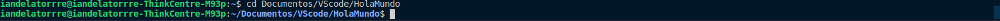
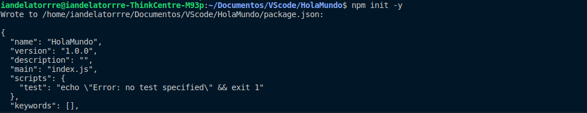
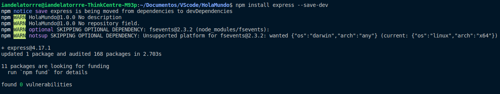
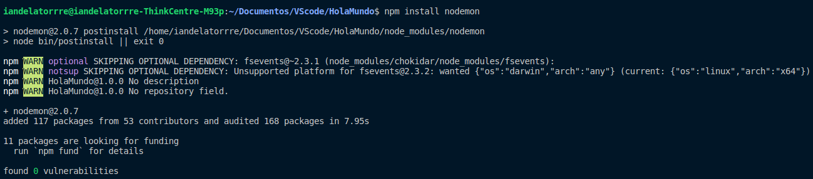
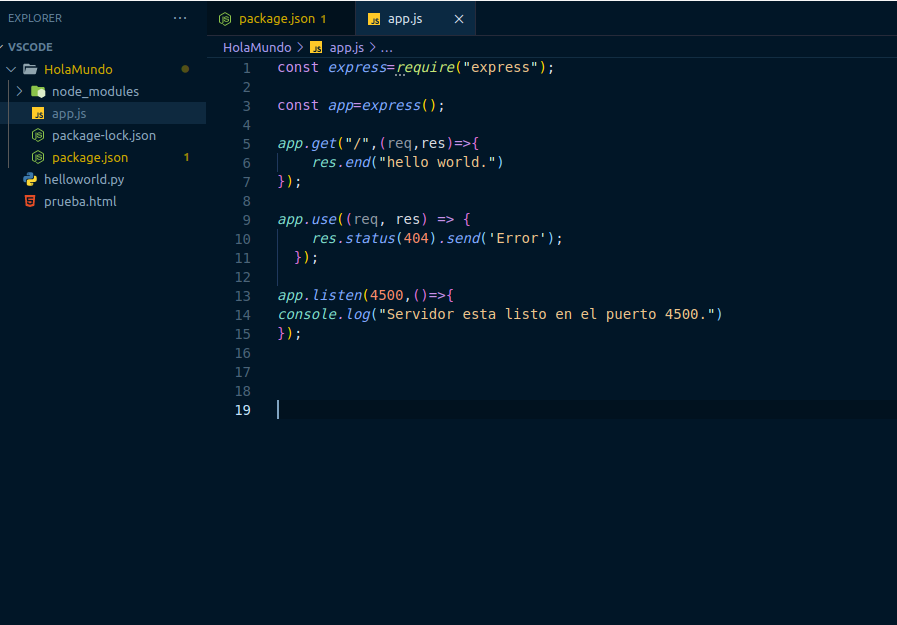
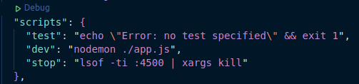
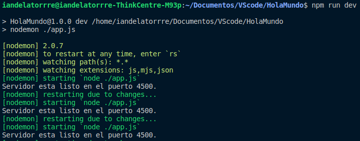
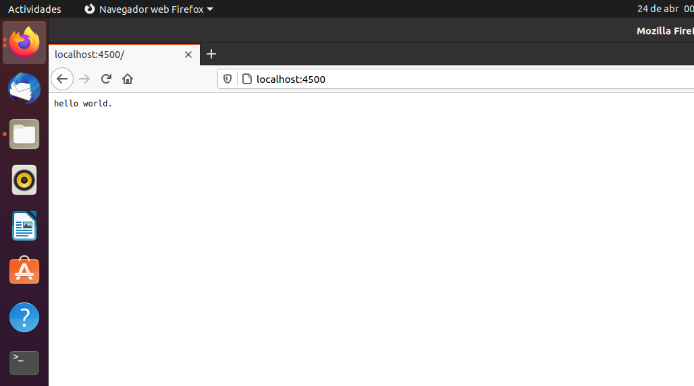

# PrimerosPasosNodejs
## Requisitos 
* Necesitas ya tener instalado el Node y en caso de que lo tengas lo puedes descargar desde [aqui.](https://nodejs.org/es/download/)
* Te recomiendas que tengas instalado el [VSCode](https://code.visualstudio.com/download) pero puedes trabajar donde te sientas mas comodo.

## Proceso
1. Necesitas colocarte en la carpeta donde vas a trabajar tu _HelloWorld_, en este caso yo cree una carpeta llamada _HolaMundo_ por lo que use `cd Documents/VScode/HolaMundo` 
2. Estando en la carpeta ya podemos empezar y para eso se usa el codigo `npm init -y` con esto se nos crea un arhivo "packaje.json". 
3. Instalamos _express_ y usamos el codigo `npm install express --save-dev` 
4. Instalamos _nodemon_ y para eso se ocupa el codigo `npm install nodemon` 
5. Teniendo esto ya podemos comenzar con la programacion, para esto creamos un archivo llamado **_app.js_** en la carpeta de _HolaMundo_ dentro de esta app se pone el siguiente codigo  
   `const express=require("express");` 
   `const app=express();` 
   `app.get("/",(req,res)=>{res.end("hello world.")});` 
   `app.use((req, res) => {res.status(404).send('Error');});` 
   `app.listen(4500,()=>{console.log("Servidor esta listo en el puerto 4500.")});`
6. Al archivo llamado **_package.json_** en el apartado de scripts le agregamos
   * `"dev": "nodemon ./app.js",`con este script podemos correr nuestro servidor, vemos que se usa _nodemon_ y esto es porque nos ahorra muchas pasos cuando haces      cambios en el servidor. 
   * `"stop": "lsof -ti :4500 | xargs kill"`con este script matamos el proceso es decir que si nuestro servidor se encuentra corriendo en el puerto con esto podemos finalizarlo. 

## Resultados
1. Realizando los pasos anteriores ya estaria listo tu servidor basico y para **iniciar el servidor** simplemente tienes que poner el codigo `npm run dev`(recuerda que con este codigo es como se corren los scripts). 
2. Abres tu navegador de confianza y colocas "localhost:4500" en la barra de busqueda 

Y eso seria tu Hola Mundo con Node.  
PD recuerda que para se deje de ejecutar tu programa tienes que colocar "^C" !
